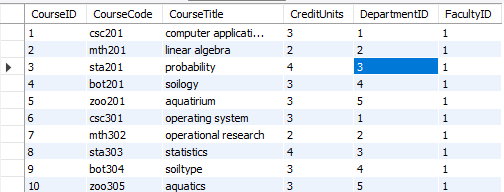
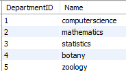
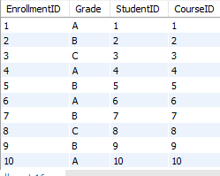
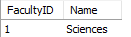
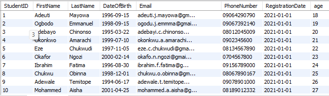

## introduction
You have been hired as a database developer for a university's new Student Records Management System. The university administration wants to track and manage essential information about students, their courses, and grades. They have asked you to design and create a relational database to store and organize the data efficiently.
The system should allow the university to:
1.	Store students' personal details such as names, date of birth, contact information, and registration numbers.
2.	Record information about courses offered by different departments, including course codes, course titles, and credit units.
3.	Track students' enrollment in courses and store their grades for each course.

## task
Your task is to design and create the database structure for this system using the appropriate Data Definition Language (DDL) commands. You'll define the necessary tables, columns, data types, and constraints, then implement these using SQL commands.
You will use the following DDL commands to accomplish this task:
•	CREATE – to create tables and define columns with appropriate data types and constraints.
•	ALTER – to modify table structures after creation if necessary.
•	DROP – to remove tables or columns that are no longer needed.
. The university now requests that only students above the age of 18 should be enrolled in courses. 
Update the database structure or queries to enforce this constraint.

## Steps and Requirements
1.	Create the Students table
This table should store information about each student.
Columns:
student_id (Primary Key, INT, Auto-increment)
first_name (VARCHAR(50), Not NULL)
last_name (VARCHAR(50), Not NULL)
date_of_birth (DATE)
email (VARCHAR(100), Unique)
phone_number (VARCHAR(15), Unique)
Constraints: Add appropriate constraints such as NOT NULL, UNIQUE, and PRIMARY KEY.
2.	Create the Courses table
	This table should store details about the courses offered at the university.
Columns:
course_id (Primary Key, INT, Auto-increment)
course_code (VARCHAR(10), Unique, Not NULL)
course_title (VARCHAR(100), Not NULL)
credit_units (INT, Not NULL)
Constraints: Ensure unique course codes and enforce NOT NULL on important columns.
3.	Create the Enrollments table
This table will track which students are enrolled in which courses, as well as the grades they receive.
Columns:
enrollment_id (Primary Key, INT, Auto-increment)
student_id (INT, Foreign Key referencing Students)
course_id (INT, Foreign Key referencing Courses)
grade (CHAR(2), Default to NULL)
Constraints: Use FOREIGN KEY constraints to establish relationships between Enrollments, Students, and Courses.
4.	Alter tables to make updates (optional)
After creating the initial tables, the university decides they need to store additional information:
Add a column registration_date (DATE) to the Students table.
Add a column department (VARCHAR(50)) to the Courses table.
5.	Drop a table (optional)
The university decides that they no longer need the Enrollments table and wants you to drop it. Write a query to DROP the Enrollments table.

## Expected Deliverables
1.	SQL scripts that perform the following:
Create the Students, Courses, and Enrollments tables.
Add the necessary constraints for primary keys, foreign keys, unique constraints, and not null constraints.
Modify tables using the ALTER command to add new columns.
Drop the Enrollments table.
2.	A brief description explaining:
Why each table is necessary.
The relationships between the tables and how they help maintain referential integrity in the database.

## Expected Deliverables
1.	SQL scripts that perform the following:
Create the Students, Courses, and Enrollments tables.
Add the necessary constraints for primary keys, foreign keys, unique constraints, and not null constraints.
Modify tables using the ALTER command to add new columns.
Drop the Enrollments table.
2.	A brief description explaining:
Why each table is necessary.
The relationships between the tables and how they help maintain referential integrity in the database.

## course table
this table consists of the list of courses in each department

## department table
this table consists of the list of departments we have in faculty

## enrollment table
this table consists of the enrollee of each courses

## faculty table
this table consists of the student faculty

## student table
this table consists of the list of students that enrolled for the courses

## conclusion
this project is developed to create a simple student records management system for 30 students. more robust and scalable project on database
will be done in the future.

